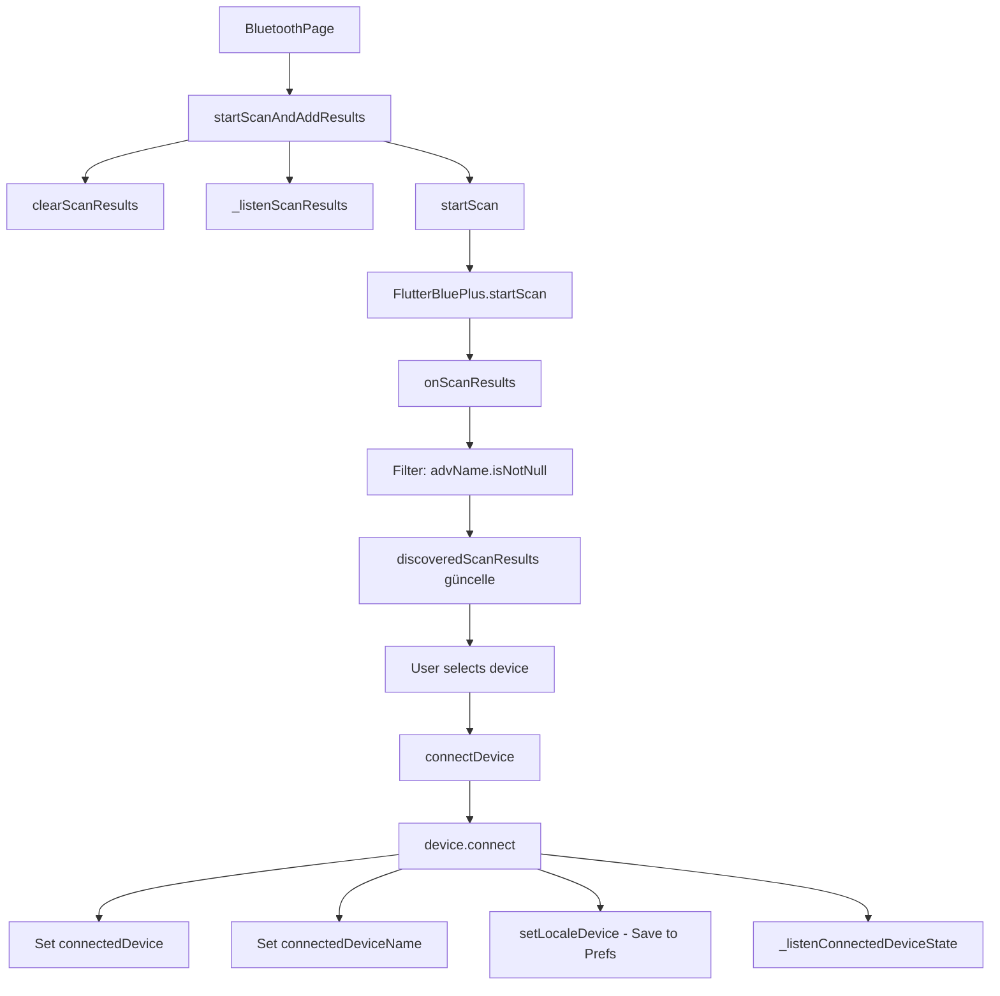
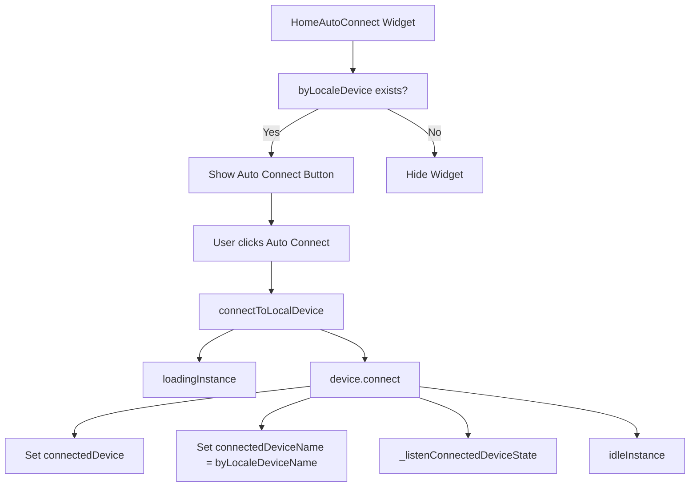
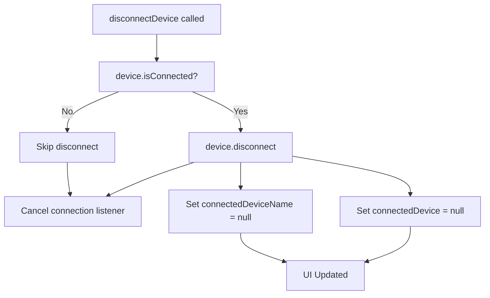

# THY Lifevest - BLE (Bluetooth Low Energy) Flow Documentation

## 📡 BLE Mimarisi ve Akış Diagramı

### Genel Mimari
```
┌─────────────────┐    ┌──────────────────┐    ┌─────────────────┐
│   UI Layer      │────│  State Manager   │────│  Preferences    │
│                 │    │                  │    │                 │
│ • HomeAutoConnect│    │ AppBluetoothCubit│    │    BlePref      │
│ • BluetoothPage │    │                  │    │                 │
└─────────────────┘    └──────────────────┘    └─────────────────┘
         │                       │                       │
         │                       │                       │
         ▼                       ▼                       ▼
┌─────────────────┐    ┌──────────────────┐    ┌─────────────────┐
│ Flutter Blue+   │    │ AppBluetoothState│    │ SharedPrefs     │
│                 │    │                  │    │                 │
│ • Device Scan   │    │ • connectedDevice│    │ • deviceName    │
│ • Connect/Disc. │    │ • deviceName     │    │ • deviceAddress │
│ • State Listen  │    │ • byLocaleDevice │    │                 │
└─────────────────┘    └──────────────────┘    └─────────────────┘
```

## 🔄 BLE State Management

### AppBluetoothState Fields

```dart
@freezed
class AppBluetoothState {
  // Connection Status
  UIStateStatus status                    // loading, idle, error
  BluetoothConnectionState bleConnectionState
  
  // Current Connected Device
  BluetoothDevice? connectedDevice        // Aktif bağlı cihaz
  String? connectedDeviceName            // Bağlı cihazın adı
  
  // Last Saved Device (Local Preferences)
  BluetoothDevice? byLocaleDevice        // Son kayıtlı cihaz
  String? byLocaleDeviceName            // Son kayıtlı cihaz adı
  
  // Adapter & Scan
  BluetoothAdapterState? adapterState    // Bluetooth adapter durumu
  bool isScanByFlutterBluePlus          // Scan durumu
  List<ScanResult> discoveredScanResults // Bulunan cihazlar
  
  // Error Handling
  Failure? failure                       // Hata bilgisi
}
```

## 🚀 BLE İşlem Akışları

### 1. Uygulama Başlatma Akışı

```mermaid
graph TD
    A[App Start] --> B[main.dart]
    B --> C[initializeDependencies]
    C --> D[AppBluetoothCubit.init()]
    D --> E[_listenAdapterState]
    D --> F[_listenScanState]
    D --> G[_getAndSetLocaleDevice]
    D --> H[_isSupportedByThisDevice]
    D --> I[_turnOnBluePlus]
    G --> J[BlePref.getBleDeviceAddress]
    G --> K[BlePref.getBleDeviceName]
    J --> L[byLocaleDevice set]
    K --> L
```

### 2. Cihaz Tarama ve Bağlantı Akışı



### 3. Otomatik Bağlantı Akışı



### 4. Bağlantı Kopma Akışı



## 💾 Preferences Management

### BlePref Interface

```dart
abstract class BlePref implements IPref {
  // Save Operations
  Future<bool> saveBleDeviceName(String deviceName);
  Future<bool> saveBleDeviceAddress(String deviceAddress);
  
  // Get Operations  
  Future<String?> getBleDeviceName();
  Future<String?> getBleDeviceAddress();
  
  // Clear Operations
  Future<bool> clearBleDeviceName();
  Future<bool> clearBleDeviceAddress();
}
```

### Preferences Keys

```dart
class BlePreferencesKeys {
  static const String deviceName = 'ble_device_name';
  static const String deviceAddress = 'ble_device_address';
}
```

## 🎯 UI Components

### HomeAutoConnect Widget States

1. **Hidden State**: `byLocaleDevice.isNull && connectedDevice.isNull`
2. **Auto Connect State**: `byLocaleDevice.isNotNull && connectedDevice.isNull`
3. **Connected State**: `connectedDevice.isNotNull`

### BluetoothPage Features

1. **Device Scanning**: Sürekli tarama ve liste güncelleme
2. **Manual Connection**: Listeden cihaz seçme ve bağlanma
3. **Refresh**: Taramayı yenileme
4. **Connection Display**: Bağlı cihaz bilgisi gösterme

## 🔧 Error Handling

### Error Types

```dart
class AppBleConfigs {
  // Error Codes
  static const String errorCodeNotSupported = 'BLE_NOT_SUPPORTED';
  static const String errorCodeConnectionFailed = 'CONNECTION_FAILED';
  static const String errorCodeDisconnectionFailed = 'DISCONNECTION_FAILED';
  
  // Error Messages
  static const String errorCodeNotSupportedDescription = 'Device does not support Bluetooth';
  static const String errorCodeConnectionFailedTitle = 'Connection Error';
  static const String errorCodeDisconnectionFailedTitle = 'Disconnection Error';
}
```

## 📱 Platform Specific Notes

### iOS
- CoreBluetooth framework kullanılır
- Permissions: Bluetooth use description gereklidir
- Background modes: bluetooth-central (opsiyonel)

### Android  
- BLUETOOTH ve BLUETOOTH_ADMIN permissions gereklidir
- Android 6.0+: LOCATION permission gereklidir (BLE scan için)
- Android 12+: BLUETOOTH_SCAN, BLUETOOTH_CONNECT permissions

## 🔄 State Transitions

```
IDLE → LOADING → CONNECTED
  ↑        ↓         ↓
  ←── ERROR ←──────────
```

### State Management Rules

1. **Loading State**: Bağlantı kurulurken aktif
2. **Connected State**: Cihaz bağlı ve dinleme aktif
3. **Error State**: Hata durumunda failure bilgisi set
4. **Idle State**: Normal bekleme durumu

## 🧪 Testing Considerations

### Unit Tests
- Cubit state transitions
- Preferences save/load operations
- Error handling scenarios

### Widget Tests  
- HomeAutoConnect different states
- BluetoothPage scan and connect flow
- Button interactions

### Integration Tests
- Full BLE flow from scan to connect
- Preferences persistence
- Error scenarios

## 🔐 Security Notes

1. **Device Information**: Cihaz adresi ve adı güvenli şekilde saklanır
2. **Permissions**: Minimum gerekli permissions kullanılır
3. **Error Messages**: Hassas bilgi içermez
4. **Background Processing**: Minimal background activity

## 📊 Performance Optimization

1. **Scan Optimization**: Timeout ile sınırlı tarama
2. **State Listening**: Gerektiğinde listener aktif
3. **Memory Management**: Connection listener'ları düzgün dispose
4. **UI Updates**: BlocSelector ile optimize edilmiş rebuilds

## 🔮 Future Enhancements

1. **Multiple Device Support**: Birden fazla cihaz bağlantısı
2. **Background Sync**: Arka planda veri senkronizasyonu  
3. **Connection Quality**: RSSI tabanlı bağlantı kalitesi
4. **Auto Retry**: Bağlantı koptuğunda otomatik yeniden deneme 