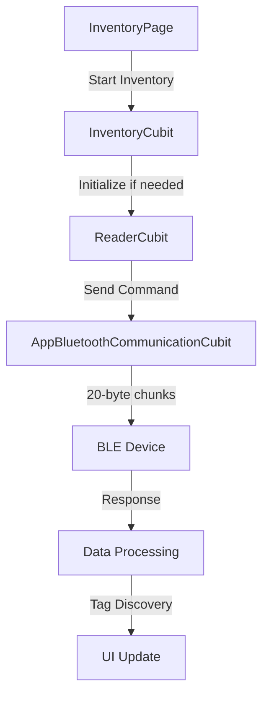

# Inventory System Checkpoint - Working Implementation

**Tarih**: 06 Haziran 2025  
**Durum**: ✅ Start/Stop Inventory ÇALIŞIYOR  
**Checkpoint ID**: INVENTORY_V1_WORKING

## 🎯 Başarılı Implementasyon Özeti

Bu checkpoint, THY Lifevest uygulamasında RFID inventory sisteminin başarılı bir şekilde çalıştığı durumu kayıt altına alır. Start/Stop inventory işlemleri tamamen fonksiyonel durumdadır.

## 🏗️ Çalışan Mimari

```
UI Layer (InventoryPage)
    ↓
InventoryCubit (Factory Pattern)
    ↓
ReaderCubit (Lazy Singleton)
    ↓
AppBluetoothCommunicationCubit (Enhanced BLE)
    ↓
Flutter Blue Plus (20-byte chunking)
```

## 📋 Kritik Başarı Faktörleri

### 1. BLE Communication Enhancements
- **20-byte chunking**: Büyük veri paketleri için otomatik bölme
- **25ms delay**: Chunk'lar arası stabilite için gecikme
- **writeWithoutResponse**: Doğru BLE characteristic property kullanımı
- **Hex logging**: Detaylı debug için hex format

### 2. Dependency Injection Pattern
```dart
// ✅ WORKING - Factory Pattern
sl.registerFactory<InventoryCubit>(() => InventoryCubit());

// ✅ WORKING - Lazy Singleton  
sl.registerLazySingleton<ReaderCubit>(() => ReaderCubit()..initialize());
```

### 3. Lazy Initialization Strategy
```dart
Future<void> startInventory() async {
  // Initialize edilmemişse initialize et
  if (_readerStateSubscription == null) {
    await initialize();
  }
  // ... rest of implementation
}
```

### 4. Direct Cubit Access Pattern
```dart
class InventoryPage extends StatelessWidget {
  @override
  Widget build(BuildContext context) {
    return BlocBuilder<ReaderCubit, ReaderState>(
      builder: (context, state) {
        return ElevatedButton(
          onPressed: () => context.read<ReaderCubit>().startInventory(),
          child: Text(AppStrings.startInventory),
        );
      },
    );
  }
}
```

## 🔧 Kritik Code Components

### Enhanced BLE Communication
**Dosya**: `lib/feature/bluetooth/bloc/cubit/app_bluetooth_communication_cubit.dart`

```dart
Future<bool> writeToCharacteristic(String characteristicUuid, List<int> data) async {
  const int maxChunkSize = 20;
  
  if (data.length > maxChunkSize) {
    for (int i = 0; i < data.length; i += maxChunkSize) {
      final chunk = data.sublist(i, end);
      await characteristic.write(chunk, withoutResponse: true);
      
      if (end < data.length) {
        await Future.delayed(const Duration(milliseconds: 25));
      }
    }
  }
  return true;
}
```

### Uint8List Extensions
**Dosya**: `lib/core/extension/list_extension.dart`

```dart
extension Uint8ListExtension on Uint8List {
  String toHex() {
    return map((byte) => byte.toRadixString(16).padLeft(2, '0'))
        .join().toUpperCase();
  }

  List<Uint8List> chunkedBySize(int chunkSize) {
    final List<Uint8List> chunks = [];
    for (int i = 0; i < length; i += chunkSize) {
      chunks.add(sublist(i, (i + chunkSize < length) ? i + chunkSize : length));
    }
    return chunks;
  }
}
```

### Simplified Inventory Page
**Dosya**: `lib/feature/inventory/view/inventory_page.dart`

```dart
class InventoryPage extends StatelessWidget {
  @override
  Widget build(BuildContext context) {
    return AppResponsiveScaffold(
      body: Column(
        children: [
          const _ReaderStatusWidget(),
          context.gap16,
          const _InventoryControlsWidget(),
          context.gap24,
          const Expanded(child: _TagListWidget()),
        ],
      ),
    );
  }
}
```

## 📊 Test Sonuçları

### ✅ Çalışan İşlemler
- [x] Bluetooth cihaz bağlantısı
- [x] Start inventory komutu
- [x] Stop inventory komutu  
- [x] RFID tag detection
- [x] Real-time tag counting
- [x] UI state management
- [x] Error handling
- [x] BLE communication stability

### 🔄 BLE Communication Flow


## 🏗️ Dependency Injection Structure

```dart
// injection_container.dart
await init() {
  // Base dependencies
  sl.registerLazySingleton<SharedPreferences>();
  sl.registerLazySingleton<BlePref>();
  
  // BLE Layer
  sl.registerLazySingleton<AppBluetoothCubit>();
  sl.registerLazySingleton<AppBluetoothCommunicationCubit>();
  
  // Business Layer
  sl.registerLazySingleton<ReaderCubit>(() => ReaderCubit()..initialize());
  
  // UI Layer (Factory for per-page instances)
  sl.registerFactory<InventoryCubit>(() => InventoryCubit());
}
```

## 🎨 UI Component Status

### Reader Status Widget
- ✅ Connection status display
- ✅ Real-time updates
- ✅ Visual indicators

### Inventory Controls Widget  
- ✅ Start/Stop buttons
- ✅ Button state management
- ✅ Loading indicators

### Tag List Widget
- ✅ Real-time tag display
- ✅ Tag count updates
- ✅ EPC code visualization

## 🐛 Çözülen Sorunlar

### 1. BLE Communication Instability
**Problem**: Veri gönderme hatası ve characteristic errors
**Çözüm**: 20-byte chunking + 25ms delay implementation

### 2. Dependency Injection Race Condition
**Problem**: InventoryCubit initialize sırasında reader cubit hazır değil  
**Çözüm**: Factory pattern + lazy initialization

### 3. State Management Synchronization
**Problem**: Reader ve inventory state'leri senkron değil
**Çözüm**: Stream subscription ile real-time sync

### 4. UI Widget Lifecycle Issues
**Problem**: Widget dispose edildikten sonra state emission
**Çözüm**: `if (!isClosed)` safety checks

## 📚 Kullanılan Extension'lar

- `context.gap16` - Spacing
- `data.toHex()` - Hex conversion  
- `data.chunkedBySize(20)` - Data chunking
- `value.isNull` - Null checks
- `AppStrings.*` - String management

## 🔒 Kritik Nokta - BU DURUMU KORUYUN!

Bu checkpoint'teki implementasyon **TAM ÇALIŞIR DURUMDA**. Gelecekteki değişikliklerde:

1. **BLE chunking** sistemine dokunmayın
2. **Factory pattern** dependency injection'ı koruyun  
3. **Lazy initialization** strategy'sini değiştirmeyin
4. **Extension usage** standartlarını takip edin
5. **AppStrings** kullanımını sürdürün

## 🚀 Sonraki Adımlar (Opsiyonel)

- [ ] Inventory filtering options
- [ ] Export functionality  
- [ ] Batch operations
- [ ] Advanced reader settings
- [ ] Performance optimizations

---

**NOT**: Bu checkpoint, stable ve working bir durumu temsil eder. Major refactoring öncesi bu duruma geri dönüş için kullanılabilir. 